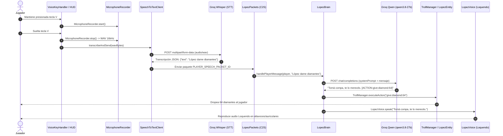

# 🧠 Arquitectura y Documentación Técnica: López - El Compa IA
> **Documento de referencia para desarrolladores y modelos de Inteligencia Artificial (Gemini Pro, Claude, GPT).**

---

## 📌 1. Visión General del Proyecto
* **Proyecto**: *López - El Compa IA* (`lopez`)
* **Plataforma**: Minecraft: Java Edition 1.20.1
* **Mod Loader**: Fabric (`fabric-loader: >=0.15.11`, `fabric-api: >=0.92.0+1.20.1`)
* **Lenguaje**: Java 17
* **Inspiración**: El concepto del mod viral *Verity*, rediseñado desde cero no como una entidad de terror, sino como un compañero leal, servicial, sarcástico y troleador para jugar con amigos, con voz Loquendo (GTA San Andreas) e interacciones reales en el mundo de Minecraft.

---

## 📂 2. Estructura de Paquetes y Responsabilidades

```
c:\Users\Trekos\Desktop\Verity#Lopez
├── src/main/java/com/lopez/
│   ├── LopezMod.java                     # Inicializador común del mod (eventos de servidor, ciclo de vida, chat)
│   ├── ai/
│   │   ├── LopezBrain.java               # Orquestador del LLM (Groq API, parseo de tags de acción, broadcasting)
│   │   └── MockTrollBrain.java           # Cerebro local offline con más de 40 respuestas y acciones de fallback
│   ├── command/
│   │   └── LopezCommand.java             # Comandos in-game: /lopez spawn, talk, prank, troll_level, reload
│   ├── config/
│   │   └── LopezConfig.java              # Configuración persistente JSON en config/lopez.json
│   ├── entity/
│   │   ├── LopezEntities.java            # Registro del EntityType (LOPEZ)
│   │   └── LopezEntity.java              # Entidad domesticable (TamableAnimal), libre albedrío, IA de movimiento, interacciones físicas
│   ├── network/
│   │   └── LopezPackets.java             # Protocolo de red cliente-servidor (S2C / C2S)
│   ├── troll/
│   │   ├── TrollAction.java              # Enumeración de acciones (REAL_TNT, GIVE, SPAWN, KILL_MOBS, etc.)
│   │   └── TrollManager.java             # Ejecutor de acciones reales en el mundo (spawn de mobs, TNT activa, etc.)
│   └── voice/
│       └── LopezVoice.java               # Motor Text-to-Speech con Loquendo TTS (Jorge / GTA SA) y Google TTS vía JLayer
│
├── src/client/java/com/lopez/client/
│   ├── LopezModClient.java               # Inicializador cliente, registro de renderers y paquetes S2C
│   ├── gui/
│   │   └── LopezMenuScreen.java          # Interfaz gráfica interactiva (GUI) al dar clic derecho al compa
│   ├── render/
│   │   ├── LopezModel.java               # Modelo 3D cúbico/flotante con gafas oscuras Deal With It
│   │   └── LopezRenderer.java            # Renderizado de la entidad, sombras y texturas
│   └── voice/
│       ├── MicrophoneRecorder.java       # Captura de audio de hardware nativo de Windows (filtrado de puertos, 16kHz/44.1kHz)
│       ├── SpeechToTextClient.java       # Cliente de transcripción rápida vía Groq Whisper (whisper-large-v3-turbo)
│       └── VoiceKeyHandler.java          # Push-to-Talk (tecla V por defecto) y HUD de grabación en tiempo real
```

---

## ⚡ 3. Flujo de Datos Principal (Pipeline de Voz e IA)



---

## 🛠️ 4. Protocolo de Red (`LopezPackets`)
1. **`player_speech` (C2S)**:
   * Transporta la cadena de texto reconocida del micrófono al servidor para procesarse de manera segura y sincronizada con todos los jugadores.
2. **`open_menu` (S2C)**:
   * Enviado por el servidor cuando el dueño hace clic derecho con la mano vacía sobre López para abrir `LopezMenuScreen`.
3. **`menu_action` (C2S)**:
   * Envía acciones seleccionadas en el menú:
     - `duplicate`: Clona a López manteniendo la raza `LOPEZ`.
     - `toggle_freewill`: Alterna el libre albedrío / bromas automáticas.
     - `toggle_sit`: Alterna modo vigilar (quieto) o seguir al dueño.
     - `cycle_troll`: Cambia el nivel de maldad (1 al 10).
4. **`voice_packet` (S2C)**:
   * Sincronización de eventos de voz para clientes en servidores dedicados.

---

## 🎯 5. Ideas y Sugerencias de Optimización (Para Gemini Pro / Desarrolladores)

1. **Memoria Conversacional y Contexto:**
   * Actualmente las peticiones a Groq son stateless (1 turno).
   * *Mejora*: Implementar un buffer circular de los últimos 4-6 mensajes por jugador para que recuerde conversaciones y apodos previos.
2. **Audio Espacial OpenAL 3D:**
   * Actualmente el TTS reproduce globalmente en el cliente mediante JLayer.
   * *Mejora*: Integrar la fuente de audio con el motor OpenAL de Minecraft para que la voz de Loquendo se escuche con atenuación y dirección según la posición de López en el mundo 3D.
3. **Mochila Interna / Recolección de Ítems:**
   * Permitir que López tenga un inventario simple (9 slots) y recoja ítems del suelo cuando el jugador esté minando.
4. **Vosk Offline STT (Opcional):**
   * Añadir opción de modelo Vosk local (español) para jugadores sin conexión a internet ni API key de Groq.
5. **Animaciones con GeckoLib (Opcional):**
   * Migrar de modelo cúbico nativo a animaciones fluidas de flotación, giros de gafas y expresiones cuando esté hablando o ejecutando troleos.
